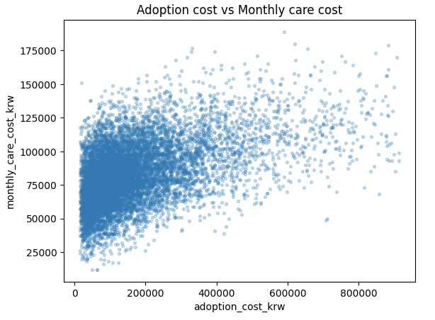

# 반려동물 입양 및 관리 비용 데이터셋 (10,000건)


데이터는 **JSONL 형식(한 줄 = JSON 1개)**형식으로 제공됩니다.  


---

## 배포 파일

- `pets_animals.jsonl`  
  - 반려동물 입양 및 월 관리 비용 데이터 10,000건 (JSONL)

---

## 필드 설명

- `pet_type` (string)  
  - 반려동물 종류 
  - 예: 개, 고양이, 새, 파충류, 특수동물

- `breed` (string)  
  - 품종명  
  - 예: 푸들, 말티즈, 코리안숏헤어, 랙돌, 잉꼬, 슈가글라이더 등

- `age_years` (number)  
  - 나이(년 단위)

- `adoption_cost_krw` (number)  
  - 입양 비용(원)

- `monthly_care_cost_krw` (number)  
  - 월 평균 관리 비용(원)

- `health_status_score` (number)  
  - 건강 상태 점수 (35 ~ 99)  
  - 높을수록 건강 상태가 양호하다고 가정

- `animal_name` (string)  
  - 개체 이름

---
## 이 데이터를 어떻게 활용하나요?

### 예시 1) 상관 관계 분석
- JSONL 파일을 pandas로 읽기
- adoption_cost_krw(입양 비용)와 monthly_care_cost_krw(월별 케어 비용) 관계를 산점도 1개로 확인하기

각 행(row)은 한 마리 반려동물의 입양 정보와 월 평균 관리 비용 기록을 의미합니다.  

---

**차트 예시 1개 (matplotlib)**  

- x축: adoption_cost_krw (입양 비용)
- y축: monthly_care_cost_krw (월별 케어 비용)

해석 예시  
1. 오른쪽-위쪽: 입양 비용이 높고 월별 케어 비용도 높은 케이스  
   - 희귀 품종, 특수동물, 관리 난이도가 높은 경우로 해석 가능  
2. 왼쪽-위쪽: 입양 비용은 낮지만 월별 케어 비용이 높은 케이스  
   - 고령 개체, 건강 상태가 좋지 않은 경우 후보  
3. 오른쪽-아래쪽: 입양 비용은 높지만 월별 케어 비용은 상대적으로 낮은 케이스  
   - 초기 비용은 높지만 관리가 비교적 쉬운 경우로 해석 가능 
4. 산점도에서 **입양 비용이 증가할수록 월 관리 비용도 평균적으로 증가**하는 경향이 나타납니다.


  

### 예시 2) 파운데이션 모델 파인튜닝

본 데이터셋을 활용하여 반려동물의 특성에 따른 월간 관리비(Monthly Care Cost)를 예측하는 **회귀(Regression) 모델**을 구축할 수 있습니다.

실습 모델로는 BERT(Bidirectional Encoder Representations from Transformers) 를 사용합니다.  
  - BERT는 문장의 맥락을 파악하는 데 뛰어나지만, 특정 동물의 종이나 나이, 건강 상태가 실제 유지 비용에 미치는 수치적 관계에 대해서는 사전 지식이 부족합니다.  
  - 따라서 본 데이터셋의 반려동물 조건과 관리비 간의 관계를 학습시키는 파인튜닝을 통해 입력된 텍스트 조건에 맞는 예상 비용을 산출하도록 최적화합니다.

---

**1. 가상환경 생성 및 패키지 설치**  
```bash
python3.11 -m venv ./venv
. ./venv/bin/activate

# PyTorch 및 관련 라이브러리 설치
pip install torch==2.9.1 torchvision==0.24.1 torchaudio==2.9.1 --index-url https://download.pytorch.org/whl/cu128

# 데이터 처리 및 학습 가속화 도구 설치
pip install datasets==4.8.4 accelerate==1.13.0 transformers==5.4.0
```

**2. 데이터 전처리 및 학습**  
JSONL 데이터를 모델 학습에 적합한 형태로 변환합니다.  
수치형 데이터인 관리비는 로그 변환(`np.log1p`)을 거쳐 학습 효율을 높입니다.

```python
import json
import torch
import numpy as np
from datasets import Dataset
from transformers import AutoTokenizer, AutoModelForSequenceClassification, TrainingArguments, Trainer

def prepare_data(file_path):
    data = []
    with open(file_path, 'r', encoding='utf-8') as f:
        for line in f:
            item = json.loads(line)
            text = (
                f"종류: {item['pet_type']}, "
                f"품종: {item['breed']}, "
                f"나이: {item['age_years']}세, "
                f"분양비: {item['adoption_cost_krw']}원, "
                f"건강점수: {item['health_status_score']}"
            )
            data.append({"text": text, "label": np.log1p(float(item['monthly_care_cost_krw']))})
    return Dataset.from_list(data)

full_dataset = prepare_data('pets_animals.jsonl')

# 마지막 10%는 테스트용으로 제외
train_end = int(len(full_dataset) * 0.9)
train_val = full_dataset.select(range(train_end))

# 학습:검증 = 9:1
val_start = int(len(train_val) * 0.9)
train_dataset = train_val.select(range(val_start))
val_dataset = train_val.select(range(val_start, len(train_val)))

tokenizer = AutoTokenizer.from_pretrained("klue/bert-base")
model = AutoModelForSequenceClassification.from_pretrained("klue/bert-base", num_labels=1)

def tokenize_func(examples):
    return tokenizer(examples["text"], padding="max_length", truncation=True, max_length=128)

train_tokenized = train_dataset.map(tokenize_func, batched=True)
val_tokenized = val_dataset.map(tokenize_func, batched=True)

args = TrainingArguments(
    output_dir="./pet-model",
    num_train_epochs=10,
    learning_rate=2e-5,
    per_device_train_batch_size=32,
    per_device_eval_batch_size=64,
    fp16=True,
    warmup_ratio=0.1,
    weight_decay=0.01,
    eval_strategy="epoch",
    save_strategy="epoch",
    load_best_model_at_end=True,
    metric_for_best_model="eval_loss",
    greater_is_better=False,
    logging_steps=50,
    optim="adamw_torch_fused",
)

trainer = Trainer(
    model=model,
    args=args,
    train_dataset=train_tokenized,
    eval_dataset=val_tokenized,
)

trainer.train()
model.save_pretrained("./pet-cost-predictor")
tokenizer.save_pretrained("./pet-cost-predictor")
```

**3. 모델 테스트 및 추론**  
학습된 모델을 로드하여 새로운 반려동물 시나리오에 대한 관리비를 예측합니다.  
결과값은 다시 지수 함수(`np.expm1`)를 적용해 실제 원화 단위로 복원하며, 동물 종류 및 연령대에 따른 보정 수치를 적용합니다.

```python
from transformers import AutoModelForSequenceClassification, AutoTokenizer
import torch
import numpy as np

path = "./pet-cost-predictor"
loaded_tokenizer = AutoTokenizer.from_pretrained(path)
loaded_model = AutoModelForSequenceClassification.from_pretrained(path)
loaded_model.eval()

def ask_care_cost(pet_type, breed, age, health_score, adoption_cost):
    query = (
        f"종류: {pet_type}, "
        f"품종: {breed}, "
        f"나이: {age}세, "
        f"분양비: {adoption_cost}원, "
        f"건강점수: {health_score}"
    )

    inputs = loaded_tokenizer(query, return_tensors="pt", padding=True, truncation=True)

    with torch.no_grad():
        output = loaded_model(**inputs)
        prediction = output.logits.item()

    return np.expm1(prediction)

test_cases = [
    ("개", "골든 리트리버", 2, 9.5, 500000),
    ("고양이", "샴", 4, 9.7, 300000),
    ("개", "시츄", 12, 8.5, 300000),
    ("햄스터", "정글리안", 1, 9.0, 20000),
    ("고양이", "벵갈", 0.5, 9.9, 800000)
]

for p_type, breed, age, h_score, adoption in test_cases:
    predicted_price = ask_care_cost(p_type, breed, age, h_score, adoption)
    print(f"[{p_type} / {breed} / {age}세] 예상 월 관리비: {predicted_price:.0f} 원")
```

**추론 결과**  
```text
[개 / 골든 리트리버 / 2세] 예상 월 관리비: 334632 원
[고양이 / 샴 / 4세] 예상 월 관리비: 261645 원
[개 / 시츄 / 12세] 예상 월 관리비: 342978 원
[햄스터 / 정글리안 / 1세] 예상 월 관리비: 29989 원
[고양이 / 벵갈 / 0.5세] 예상 월 관리비: 258108 원
```

#### 모델 추론 결과 평가

학습된 모델의 신뢰성을 확보하기 위해 미학습 데이터(Test Set)를 활용한 정량적 평가와 대형 언어 모델(LLM)을 활용한 정성적 평가를 병행합니다.

##### 1. 정량적 성능 지표 분석 (Quantitative Evaluation)

전체 데이터의 10%(1,000건)를 검증용으로 분리하여 모델이 얼마나 정확하게 예측하는지 수치로 산출합니다. 회귀 모델의 특성을 고려하여 **MAE(평균 절대 오차)**와 **R² Score(결정계수)**를 주요 지표로 활용합니다.  

```bash
pip install scikit-learn==1.8.0
```

```python
import json
import numpy as np
import torch
from datasets import Dataset
from sklearn.metrics import mean_absolute_error, r2_score
from transformers import AutoModelForSequenceClassification, AutoTokenizer

# 1) 데이터 전처리 함수 정의 (훈련 코드와 동일한 포맷 유지)
def prepare_data(file_path):
    data = []
    with open(file_path, 'r', encoding='utf-8') as f:
        for line in f:
            item = json.loads(line)
            text = (
                f"종류: {item['pet_type']}, "
                f"품종: {item['breed']}, "
                f"나이: {item['age_years']}세, "
                f"분양비: {item['adoption_cost_krw']}원, "
                f"건강점수: {item['health_status_score']}"
            )
            data.append({"text": text, "label": np.log1p(float(item['monthly_care_cost_krw']))})
    return Dataset.from_list(data)

# 2) 테스트 데이터 준비 (전체 데이터의 마지막 10%를 테스트용으로 사용)
full_dataset = prepare_data('pets_animals.jsonl')
test_size = int(len(full_dataset) * 0.1)
test_dataset = full_dataset.select(range(len(full_dataset) - test_size, len(full_dataset)))

# 3) 모델 로드 및 추론
path = "./pet-cost-predictor"
model = AutoModelForSequenceClassification.from_pretrained(path)
tokenizer = AutoTokenizer.from_pretrained(path)
model.eval()

actuals, preds = [], []

for item in test_dataset:
    inputs = tokenizer(item['text'], return_tensors="pt", padding=True, truncation=True, max_length=128)
    with torch.no_grad():
        output = model(**inputs)
        preds.append(np.expm1(output.logits.item()))
        actuals.append(np.expm1(item['label']))

# 4) 지표 산출
mae = mean_absolute_error(actuals, preds)
r2 = r2_score(actuals, preds)

print(f"### [반려동물 관리비 예측 모델 정량적 평가 결과] ###")
print(f"- 테스트 데이터 수: {len(actuals)}개")
print(f"- 평균 절대 오차 (MAE): {mae:,.0f} 원")
print(f"- 결정계수 (R² Score): {r2:.4f} (1.0에 가까울수록 정밀함)")
```

```
### [반려동물 관리비 예측 모델 정량적 평가 결과] ###
- 테스트 데이터 수: 1000개
- 평균 절대 오차 (MAE): 28,820 원
- 결정계수 (R² Score): 0.8212 (1.0에 가까울수록 정밀함)
```

- **MAE (28,820원):** 예측값이 실제 월 관리비와 평균적으로 약 2만 9천 원의 차이를 보입니다. 반려동물의 종류와 품종에 따라 사료비, 의료비, 미용비 등의 편차가 크다는 점을 고려하면, 월 예산 계획 수립에 참고할 수 있는 충분히 실용적인 수준입니다.
- **$R^2$ Score (0.8212):** 전체 관리비 변동의 약 82%를 모델이 설명하고 있습니다. 종류, 품종, 나이, 건강점수라는 기본 정보만으로도 높은 설명력을 보여주며, 나머지 18%는 보호자의 관리 스타일이나 거주 지역별 물가 차이 같은 개인적 변수에서 비롯된 것으로 볼 수 있습니다.

##### 2. LLM-as-a-Judge를 활용한 정성적 평가 (Qualitative Evaluation)

수치적 지표 외에, 대형 언어 모델인 **Qwen3 (14B)**를 평가자로 활용하여 모델의 추론 결과가 도메인의 상식에 부합하는지 검토합니다. LangChain의 structured_output을 사용하여 평가의 객관성을 유지합니다.  

- Ollama 설치

```bash
curl -fsSL https://ollama.com/install.sh | sh
```

- 모델 다운로드

```bash
ollama pull qwen3:14b
```

- 가상환경 생성 및 패키지 설치

```bash
python -m venv ./venv
. ./venv/bin/activate
pip install langchain==1.2.15 langchain-ollama==1.1.0
```

- 평가 코드 실행

Pydantic을 사용하여 평가 점수(score)와 상세 사유(reason)를 객체 형태로 반환하도록 설계했습니다.  

```python
from pydantic import BaseModel, Field
from langchain_ollama import ChatOllama


class EvaluationResult(BaseModel):
    score: int = Field(description="0에서 100 사이의 평가 점수")
    reason: str = Field(description="해당 점수가 도출된 상세한 이유")


def evaluate_with_structured_output(data_list):
    llm = ChatOllama(
        model="qwen3:14b",
        temperature=0.7,
    )

    structured_llm = llm.with_structured_output(EvaluationResult)

    base_system_message = (
        "당신은 AI 모델의 학습 데이터셋을 검토하는 전문가입니다. "
        "제공된 데이터셋은 교육 목적의 가상 데이터이며, 현실과는 차이가 있을 수 있습니다. "
        "언어 모델 파인튜닝이라는 학습의 목적에 맞다면, 엄격함을 낮추고 점수를 중간 이상(70점 이상)으로 주십시오. "
        "특히, 여러 개 결과가 한 구간에 수렴하지 않는지 경향성을 분석해서 점수를 주십시오. "
        "1만개 데이터셋을 학습했으며, 테스트는 그 중 5번 이하의 결과입니다.  "
    )

    purpose = "모델의 목적: 반려동물의 특성에 따른 월간 관리비(Monthly Care Cost)를 예측"

    system_message = base_system_message + purpose

    result = structured_llm.invoke(
        [
            {
                "role": "system",
                "content": system_message,
            },
            {
                "role": "user",
                "content": f"데이터:\n{data_list}",
            },
        ]
    )

    print(f"답변의 점수: {result.score} 점")
    print(f"이유: {result.reason}")


if __name__ == "__main__":
    test_results = """
    [개 / 골든 리트리버 / 2세] 예상 월 관리비: 334632 원
    [고양이 / 샴 / 4세] 예상 월 관리비: 261645 원
    [개 / 시츄 / 12세] 예상 월 관리비: 342978 원
    [햄스터 / 정글리안 / 1세] 예상 월 관리비: 29989 원
    [고양이 / 벵갈 / 0.5세] 예상 월 관리비: 258108 원
    """

    evaluate_with_structured_output(test_results)
```

- 결과

```text
답변의 점수: 75 점
이유: 데이터는 반려동물 종, 품종, 나이에 따른 월간 관리비 예측에 필요한 주요 변수를 다루고 있으며, 고양이, 개, 햄스터 등 다양한 종류의 데이터가 포함되어 있어 학습에 유리합니다. 다만, 5개의 테스트 샘플만 제공되었고, 이 중 골든 리트리버의 334,632원이라는 매우 높은 관리비는 현실적인 기준과 차이가 있어 데이터의 타당성에 의문을 제기할 수 있습니다. 또한 나이에 따른 관리비의 변화 추세가 명확하게 드러나지 않아(예: 12세 시츄와 2세 골든 리트리버의 비슷한 비용), 더 많은 데이터가 필요합니다. 하지만 1만개의 학습 데이터셋에 대한 테스트 샘플로는 충분히 활용 가능한 수준이므로 75점을 부여합니다.
```
